# 0 准备安装环境

```shell
sudo docker  network create --driver bridge --subnet 173.199.8.0/24 nezha_es_net

sudo  docker network ls | grep nezha_es_net
sudo  docker network inspect nezha_es_net
sudo  docker network rm nezha_es_net

#删除指定名字的容器
sudo docker rm -f $(sudo docker ps -a |  grep "nezha*"  | awk '{print $1}')
#删除全部容器
docker rm $(docker ps -aq)
```

> `$( )`与``（反引号）都是用来作命令替换；用于重组命令行，先完成引号里的命令行，然后将其结果替换出来，再重组成新的命令行。

## 1 安装

> 注：安装ES的服务器，内存一定要大，不然会出现，创建成功启动后，过一段时间会自动关闭。重启后又会重复出现`自动关闭`的情况，导致集群节点停止运行

```shell
sudo docker-compose -f docker-compose-es.yml up -d

sudo docker ps --filter name=es+
sudo docker ps --filter name=kibana
sudo docker logs es3

#报错
ERROR: [1] bootstrap checks failed
[1]: max virtual memory areas vm.max_map_count [65530] is too low, increase to at least [262144]
#解决：
sudo vim /etc/sysctl.conf
  vm.max_map_count = 655360 
#保存后，执行：
sysctl -p
```

## 2 验证

Web方式：

```shell
#检查集群中的节点
http://192.168.145.131:9200/_cat/nodes
```
正确如图所示：  
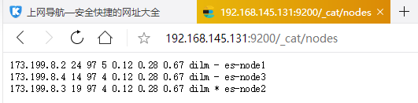
```shell
#kibana
http://192.168.145.131:5601
```
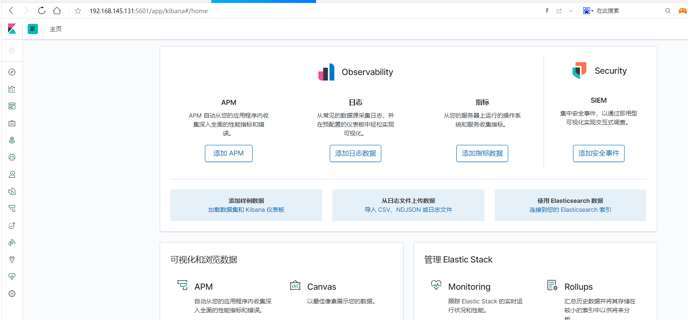
```shell
#es-head
http://192.168.145.131:9100
es-head连接ES集群的地址：http://192.168.145.131:9200/
```
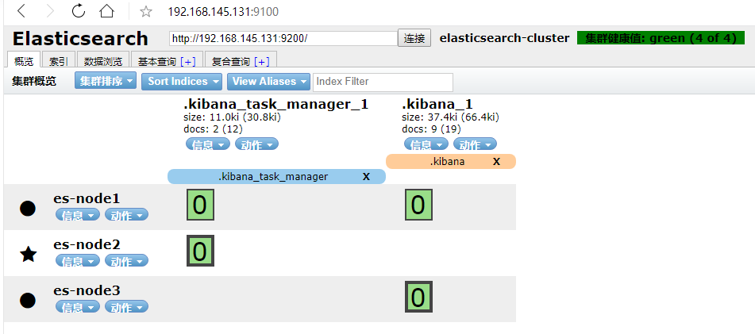
## 3 ES基本操作
ES安装分词  
```shell
[nezha@nezha_user config]$ wget https://github.com/medcl/elasticsearch-analysis-ik/releases/download/v7.6.1/elasticsearch-analysis-ik-7.6.1.zip 
[nezha@nezha_user config]$ sudo docker cp elasticsearch-analysis-ik-7.6.1.zip nezha_nezha_user_es-1:/usr/share/elasticsearch/plugins

#进入容器
[nezha@nezha_user config]$ sudo docker exec -it nezha_nezha_user_es-1  bash
[root@a2d3e9170ae5 elasticsearch]# mkdir -p /usr/share/elasticsearch/plugins/ik
[root@a2d3e9170ae5 elasticsearch]# ls
LICENSE.txt  NOTICE.txt  README.asciidoc  bin  config  data  jdk  lib  logs  modules  plugins

[root@a2d3e9170ae5 elasticsearch]# mv /usr/share/elasticsearch/plugins/elasticsearch-analysis-ik-7.6.1.zip /usr/share/elasticsearch/plugins/ik
[root@a2d3e9170ae5 elasticsearch]# cd /usr/share/elasticsearch/plugins/ik

[root@a2d3e9170ae5 ik]# unzip elasticsearch-analysis-ik-7.6.1.zip 
Archive:  elasticsearch-analysis-ik-7.6.1.zip
  inflating: elasticsearch-analysis-ik-7.6.1.jar  
  inflating: httpclient-4.5.2.jar    
  inflating: httpcore-4.4.4.jar      
  inflating: commons-logging-1.2.jar  
  inflating: commons-codec-1.9.jar   
  inflating: plugin-descriptor.properties  
  inflating: plugin-security.policy  
   creating: config/
  inflating: config/main.dic         
  inflating: config/quantifier.dic   
  inflating: config/extra_single_word_full.dic  
  inflating: config/IKAnalyzer.cfg.xml  
  inflating: config/surname.dic      
  inflating: config/suffix.dic       
  inflating: config/stopword.dic     
  inflating: config/extra_main.dic   
  inflating: config/extra_stopword.dic  
  inflating: config/preposition.dic  
  inflating: config/extra_single_word_low_freq.dic  
  inflating: config/extra_single_word.dic 
[root@a2d3e9170ae5 ik]# rm -rf elasticsearch-analysis-ik-7.6.1.zip 
[root@a2d3e9170ae5 ik]# ls
commons-codec-1.9.jar  commons-logging-1.2.jar  
config  elasticsearch-analysis-ik-7.6.1.jar 
httpclient-4.5.2.jar  httpcore-4.4.4.jar  
plugin-descriptor.properties  plugin-security.policy

[root@a2d3e9170ae5 ik]# exit;
exit
[nezha@nezha_user config]$ sudo docker restart nezha_nezha_user_es-1
```


### 3.1 创建索引
>请求地址：http://ip:端口/索引名称
> > **索引名称必须小写**
>
> http方法：PUT
URL：http://192.168.145.131:9200/nezha_user
```json
{
  "settings":{
    "number_of_shards":3,
    "number_of_replicas":2
  },
  "mappings":{
    "properties":{
      "id":{"type":"integer"},
      "nezha_user_name":{"type":"text"},
      "email":{"type":"text"},
      "age":{"type":"integer"}
    }
  }
}
```
>参数：

> number_of_shards：分片数量。
>
> number_of_replicas：副本数量  

成功如图所示： 
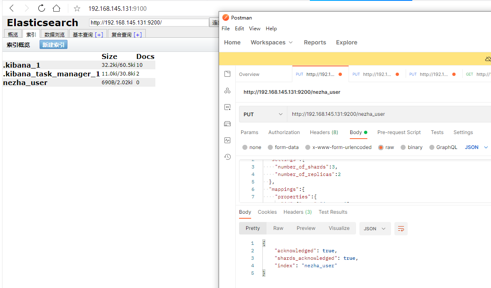

### 3.2 添加数据
> 请求方法：PUT  
> 请求地址：http://ip:端口/索引名/_doc/用户id
>
> > 上面这里不添加id就自动生成

实操：指定ID创建数据  
URL：http://192.168.145.131:9200/nezha_user/_doc/1

```json
{
  "id": "1",
  "nezha_user_name": "nezha",
  "email": "nezha@126.com",
  "age": 18
}
```
输出：
```json
{
  "_index": "nezha_user",
  "_type": "_doc",
  "_id": "1",
  "_version": 1,
  "result": "created",
  "_shards": {
    "total": 3,
    "successful": 3,
    "failed": 0
  },
  "_seq_no": 0,
  "_primary_term": 1
}
```
实操：ES内置ID创建
> 请求方法：POST  
URL：http://192.168.145.131:9200/nezha_user/_doc 
```json
{
  "id": "2",
  "nezha_user_name": "哪吒公众号：莲花童子哪吒",
  "email": "nezha@126.com",
  "age": 18
}
```
输出：
```json
{
  "_index": "nezha_user",
  "_type": "_doc",
  "_id": "FtwPCX0BAj-t4huZ0XlV",
  "_version": 1,
  "result": "created",
  "_shards": {
    "total": 3,
    "successful": 3,
    "failed": 0
  },
  "_seq_no": 0,
  "_primary_term": 1
}
```

### 3.3 查询数据
实战：获取索引中的所有文档 
> 请求方法：GET 
> 请求地址：http://ip:端口/索引名/_search
>
> > 上面这里不添加id就自动生成
URL：http://192.168.145.131:9200/nezha_user/_search
```json
{
  "query": {
    "bool": {
      "must": [
        {
          "match": {
            "user_name": "哪吒"
          }
        }
      ]
    }
  }
}
```
返回：
```json
{
  "took": 13,
  "timed_out": false,
  "_shards": {
    "total": 3,
    "successful": 3,
    "skipped": 0,
    "failed": 0
  },
  "hits": {
    "total": {
      "value": 1,
      "relation": "eq"
    },
    "max_score": 0.7911257,
    "hits": [
      {
        "_index": "nezha_user",
        "_type": "_doc",
        "_id": "FtwPCX0BAj-t4huZ0XlV",
        "_score": 0.7911257,
        "_source": {
          "id": "2",
          "nezha_user_name": "哪吒公众号：莲花童子哪吒",
          "email": "nezhas@126.com",
          "age": 18
        }
      }
    ]
  }
}
```
实战：指定ID获取数据
> 请求方法：GET  
> 请求地址：http://ip:端口/{index}/{type}/{id}
>
> > 上面这里不添加id就自动生成
URL：http://192.168.145.131:9200/nezha_user/_doc/1

实操：带搜索条件查询
> 请求方法：GET  
> 请求地址：http://ip:端口/{index}/{my_type}/_serach

URL：http://192.168.145.131:9200/nezha_user/_doc/_search
```json
{
  "query": {
    "bool": {
      "must": [
        {
          "match": {
            "user_name": "哪吒"
          }
        },
        {
          "match" : {
            "age": "18"
          }
        }
      ]
    }
  }
}
```
实操：返回文档的部分字段

> 请求方法：GET ,默认返回整个文档   
> 请求地址：http://ip:端口/{index}/{type}/{id}?_source=fullName,email  

URL：http://192.168.145.131:9200/nezha_user/_doc/123?_source=id,email


实操：只返回文档内容，不要元数据
> 请求方法：GET   
> 请求地址：http://ip:端口/{index}/{type}/{id}/_source
```shell
GET http://192.168.145.131:9200/nezha_user/_doc/1/_source
```


实战：批量获取  
方式一：

> 请求方法：GET
> 请求地址：http://ip:端口/_mget
> index相同，type不同。针对系统文档字段
```shell
GET http://192.168.145.131:9200/nezha_user/_mget 
```
```json
   {
  "docs": [
        {
            "_index": "nezha_user",
            "_type": "_doc",
            "_id": "1"
        },
        {
            "_index": "nezha_user",
            "_type": "_doc",
            "_id": "FtwPCX0BAj-t4huZ0XlV"
        }
   ]
   }
```
方式二：
> 请求方法：GET
> 请求地址：http://ip:端口/{index}/{type}/_mget
>
```shell
 http://192.168.145.131:9200/nezha_user/_doc/_mget
```
```json
   {"docs": [
        {
            "_id": "1"
        },
        {
            "_id": "FtwPCX0BAj-t4huZ0XlV"
        }
   ]
   }
```
#### 3.3.0 分页搜索    

和SQL使用` LIMIT from, size`关键字返回只有一页的结果一样，Elasticsearch接受 from 和 size 参数：

- size : 每页条数，默认 10
- from : 跳过开始的结果数，默认 0

> 请求方法：GET  
> 请求地址：http://ip:端口/{index}/{type}/_search?size=num&from=num
>
URL：http://192.168.145.131:9200/nezha_user/_doc/_search?size=5&from=2

如果你想每页显示5个结果，页码从1到3，那请求如下：
```shell
GET nezha_user/_doc/_search?size=5 #查询5条
GET nezha_user/_doc/_search?size=5&from=5 #查询6-10
GET nezha_user/_doc/_search?size=5&from=10 #查询11-15
```

**查询字符串搜索**

搜索可以用纯粹的uri来执行查询，在这种模式下使用搜索，并不是所有的选项都是暴露的。类似SQL查询

> 请求方法：GET
> 请求地址：http://ip:端口/{index}/{type}/_search?q=age:25
>
```shell
http://192.168.145.131:9200/nezha_user/_doc/_search?q=user_name:哪吒
```

#### 3.3.1 查询条件详讲 
##### 3.3.1.1 精准查询 term
查询条件都在路由的`_serach`下面进行，但可以多个条件进行组织和安排。
term 是代表完全匹配，即不进行分词器分析，文档中必须包含整个搜索的词汇
- term 单值
字段只有一个值时候，用term关键词查询。
因为是精准查询，不需要查询进行评分计算。只希望对文档进行包括或排除的计算，可使用 constant_score 。查询以非评分模式来执行 term 查询并作为统一评分

```shell
GET http://192.168.145.131:9200/nezha_user/_doc/_search 
{
    "query" : {  
        "constant_score" : {  
             "filter" : {  
                "term" : {  
                    "user_name" : "nezha"  
                }  
            }  
        }  
    }  
}
```
**terms多值**  
字段有多个值时候，用terms关键词查询，后跟数组
```json
{
    "query":{
        "terms":{
            "id":["1", "3"]
        }
    }
}
```
多 `term`字段值的查询处理
```json
{
  "from": 0,
  "size": 20,
  "query": {
    "bool": {
      "filter": [{
        "term": {
          "id":  1
        }
      },{
        "term": {
          "user_name" : "nezha"
        }
      }]
    }
  }
}
```
##### 3.3.1.2 匹配查询match

match和term区别：

- match查询的时候,elasticsearch会根据你给定的字段提供合适的分析器；但term查询不会有分析器分析的过程
- match查询相当于模糊匹配，只包含其中一部分关键词就行

 1. match

进行 full text search 或者exact value(非string字段或not_analyzed的字段)，进行匹配。  
查询字段`id`为1的值，并按 `age`倒序

```json

{
  "query": {
    "match": {
      "id": 1
    }
  },
  "sort": [
    { "age" : "desc" },
    "_score"
  ]
}
```

2. match_all
匹配所有的， 当不给查询条件时，默认全查

```json
{
	"query": {
		"match_all": {}
	}
}
```
3. multi_match

多个字段同时对查询的关键词进行匹配，即多个字段是AND的关系  
```json
{
  "query":{
    "multi_match":{
      "query": 18,
      "fields":["user_name","age"]
    }
  }
}
```
`multi_match` 多字段匹配有三种类型，用 `type` 来对类型进行声明：
1. best_fields（多个字段中，返回评分最高的）
2. most_fields（匹配多个字段，返回综合评分（非最高分）） 
3. cross_fields（跨字段，待查询内容在多个字段中都显示）  

`best_fields`类型为 `multi_match` 默认的查询类型，可以省略不写 。同时`field`还支持更为丰富的查询; 如： 

在 `fields` 中，按user_name（用户名）、email（邮箱），搜索“哪吒 nezha”关键词，user_name源值、关键字值都是100分，拼音值为80分，email源值为100分，分值由高到低优先级搜索。  

`operator` 使用and，是要返回两者同时匹配成功的结果。   

`operator` 作用于子查询与子查询之间的连接中。
应用场景：信息被索引时分割到不同字段中，如住址，姓、名。多数情况下`opertaotr`使用and   


演示： GET /nezha_user/_doc/_search
```json
{
  "query":{
    "multi_match":{
      "query": "哪吒 nezha",
      "fields":[
        "user_name^100",
        "user_name.brandName_pinyin^80",
        "email^100"
      ],
      "type": "most_fields",
      "operator": "AND"
    }
  }
}
```

4. match_phrase  
`match_phrase`查询分析文本，并从分析文本中创建短语查询。  
类似 match 查询， match_phrase 查询首先将查询字符串解析成一个词项列表，然后对这些词项进行搜索，但只保留那些包含 全部 搜索词项，且 位置与搜索词项相同的文档

如下，查询 quick brown、quick brown fox、 brown fox可以查询到，quick fox 查询不到; 有点类似于 `MySQL` 的最左匹配
```json
{  
   "query": {  
          "match_phrase": {  
              "title": "quick brown fox"  
          }  
   }  
} 
```

查询 a,b，a和b之间隔3个字符可以查询到，而不是3个查询不到
```json
{
    "query":{
        "match_phrase" :{
          "user_name" : {
            "query":"a,b",
            "slop":3
          }
        }
    }
}
```

#####  3.3.1.3 bool查询

bool查询包含四种操作符，分别是**must, should, must_not,query**。它们均是一种数组，数组里面是对应的判断条件

- must： 必须匹配，与 and 等价。并且参与计算分值
- filter： 过滤子句，必须匹配，但不参与计算分值
- must_not：必须不匹配，与not等价，常过滤子句用，但不参与计算分值
- should： 选择性匹配，至少满足一条，与 OR 等价。参与计算分值

ES旧版本写法：<7;   
filtered是比较老的的版本的语法。现在目前已经被bool替代。推荐使用bool     

解释： 查询条件id=1或user_name=nezha的结果记录，但结果记录要!=192@qq.com
```json
{  
   "query" : {  
        "filtered" : {  
            "filter" : {
              "bool" : {
                "should" : [
                  { "term" : {
                    "id" : 1
                  }
                  },
                  { "term" : {
                    "user_name" : "nezha"
                  }
                  }
                ],
                "must_not" : {
                  "term" : {
                    "email" : "192@qq.com"
                  }
                }
              }
            }
        }
    }  
}
```

新版本：> 7     
解释：查询条件id=1或user_name= 哪吒 的结果记录，但结果记录要email!=192@qq.com。在匹配结果中会继续根据条件user_name!=nezha 来过滤数据
```shell

GET /nezha_user/_doc/_search 
{
  {
	"query": {

		"bool": {
			"should": [{
					"term": {
						"id": 1
					}
				},
				{
					"term": {
						"user_name": "哪吒"
					}
				}
			],
			"must_not": {
				"term": {
					"email": "192@qq.com"
				}
			},
			"filter": {
				"term": {
					"user_name": "nezha"
				}
			}
		}
	}
  }
}
```

#####  3.3.1.4 filter查询

过滤器，会查询对结果进行缓存，不会计算相关度，避免计算分值，执行速度非常快。  
如下， 查询出 id 为 1 的记录

GET /nezha_user/_doc/_search
```json
{
  "query": {
    "bool": {
      "filter": {
        "term": {
          "id": "1"
        }
      }
    }
  }
}
```
filter也常和range范围查询一起配合使用，range范围可供组合的选项

> gt : 大于
>
> lt : 小于
>
> gte : 大于等于
>
> lte :小于等于

> http方法：PUT

**建立索引：**

URL：http://192.168.145.131:9200/nezha_store_order
method：PUT

```json
{
  "settings":{
    "number_of_shards":3,
    "number_of_replicas":2
  },
  "mappings":{
    "properties":{
      "id":{"type":"integer"},
      "order_num":{"type":"text"},
      "order_id":{"type":"integer"},
      "uid ":{"type":"integer"},
      "real_name":{"type":"text"},
      "user_phone":{"type":"text"},
      "user_address":{"type":"text"},
      "cart_id":{"type":"integer"},
      "freight_price":{"type":"double"},
      "total_num":{"type":"double"},
      "total_price":{"type":"double"},
      "total_postage":{"type":"double"},
      "pay_price":{"type":"double"},
      "pay_postage":{"type":"double"},
      "deduction_price":{"type":"double"},
      "coupon_id":{"type":"integer"},
      "coupon_price":{"type":"double"},
      "paid":{"type":"integer"},
      "pay_type":{"type":"text"},
      "pay_time":{
        "type":"date",
        "format": "yyyy-MM-dd HH:mm:ss||yyyy-MM-dd||epoch_millis"
      },
      "add_time":{
        "type":"date",
        "format": "yyyy-MM-dd HH:mm:ss||yyyy-MM-dd||epoch_millis"
      },
      "status":{"type":"integer"},
      "refund_status":{"type":"integer"},
      "refund_reason_wap_img":{"type":"text"},
      "refund_reason_wap_explain":{"type":"text"},
      "refund_reason_time":{"type":"text"},
      "refund_reason_wap":{"type":"text"},
      "refund_reason":{"type":"text"},
      "refund_price":{"type":"double"},
      "delivery_name":{"type":"text"},
      "delivery_type":{"type":"text"},
      "delivery_id":{"type":"text"},
      "gain_integral":{"type":"double"},
      "back_integral":{"type":"double"},
      "mark":{"type":"text"},
      "remark":{"type":"text"},
      "mer_id":{"type":"integer"},
      "combination_id":{"type":"integer"},
      "pink_id":{"type":"integer"},
      "cost":{"type":"double"},
      "seckill_id":{"type":"integer"},
      "bargain_id":{"type":"integer"},
      "verify_code":{"type":"text"},
      "store_id":{"type":"integer"},
      "shipping_type":{"type":"integer"},
      "clerk_id":{"type":"integer"},
      "is_channel":{"type":"integer"},
      "is_remind":{"type":"integer"},
      "is_system_del":{"type":"integer"}
    }
  }
}
```

如下，查询 pay_type 值为 1 下的交易数据

```json
{
  "query": {
    "bool": {
      "must": {
        "term": {
          "pay_type": "1"
        }
      },
      "filter": {
        "range": {
          "pay_time": {
            "from": "1978-02-19 14:51:07",
            "to": "2004-08-08 21:50:33"
          }
        }
      }
    }
  }
}
```

must匹配记录条件下，filter进行过滤，range定义范围

```json
{
  "query": {
    "bool": {
      "must": [
        {
          "match": {
            "pay_type": "0"
          }
        },
        {
          "match": {
            "status": "2"
          }
        }
      ],
      "filter": [
        {
          "term": {
              "user_address": "区"
            }
        },
        {
          "range": {
            "pay_time": {
              "gte": "1996-10-06"
            }
          }
        }
      ]
    }
  }
} 
```


#####  3.3.1.5 常见查询场景

1、查询pay_type为 2，地址为 ["区","香港"]，按时间范围过滤，按下单时间倒序，每次查询100条
```json
{
  "query": {
    "bool": {
      "must": [{
        "term": {
          "pay_type": "2"
        }
      },{
        "terms": {
          "user_address": ["区","香港"]
        }
      }],
      "filter": [{
        "range": {
          "add_time": {
            "from": "1878-02-19 14:51:07",
            "to": "2022-08-02 08:37:20"
          }
        }
      }]
    }
  },
  "size": 100,
  "sort": [{
    "add_time": "desc"
  }]
}
```

##### 3.3.1.6 ES统计查询

查询索引文档中得总数量

```shell
#查询整个集群的文档数量
语法：GET /_cat/count/index_name?v
#查询索引相关的信息，而这些信息里面包含文档的数量; 
语法：GET _cat/count?v

#cat indices命令统计的文档数量是底层所有的文档数量	
	GET _cat/indices/kibana_sample_data_ecommerce?v
```

```http
http://192.168.145.131:9200/_cat/count/nezha_store_order?v
http://192.168.145.131:9200/_cat/count?v
http://192.168.145.131:9200/_cat/indices/nezha_store_order?v
```

**search api**统计文档数量，只要不指定查询条件，然后查询结果中的total就是文档的总数量。

```shell
GET nezha_store_order/_search
{
  "query": {
    "match_all": {}
  }
}
```

**聚合统计文档**

```shell
GET /nezha_store_order/_search
实例：http://192.168.145.131:9200/nezha_store_order/_search
{
    "size" : 0,
    "aggs" : {
        "my_count" : {
            "value_count": {
              "field" : "_id"
            }
        }
    }
}
```

**查看分片上的文档数量**

```shell
GET _cat/shards/nezha_store_order?v
#实例：
http://192.168.145.131:9200/_cat/shards/nezha_store_order?v
##结果输出如下：
index             shard prirep state   docs   store ip          node
nezha_store_order 2     r      STARTED   95 154.5kb 173.199.8.4 es-node3
nezha_store_order 2     p      STARTED   95 154.5kb 173.199.8.3 es-node2
nezha_store_order 2     r      STARTED   95 154.5kb 173.199.8.2 es-node1
nezha_store_order 1     p      STARTED   98 147.4kb 173.199.8.4 es-node3
nezha_store_order 1     r      STARTED   98 147.4kb 173.199.8.3 es-node2
nezha_store_order 1     r      STARTED   98 147.4kb 173.199.8.2 es-node1
nezha_store_order 0     r      STARTED  111 161.3kb 173.199.8.4 es-node3
nezha_store_order 0     r      STARTED  111 161.3kb 173.199.8.3 es-node2
nezha_store_order 0     p      STARTED  111 161.3kb 173.199.8.2 es-node1
```

- p 主分片(primary shard)
- r  副本分片（Replica fragmentation）

> cat count api和search方式统计文档哪个效率高？
>
> 推断：前者应该是更快一些，因为查询还要算分，排名这些操作，应该更耗时


### 3.4修改数据

> 请求方法：POST  
> 请求地址：`http://ip:端口/{index}/{type}/{id}`   （此方法在新的ES里已经过期）
> 请求地址：`http://ip:端口/{index}/_update/{id}  `

URL：`http://192.168.145.131:9200/nezha_user/_doc/FtwPCX0BAj-t4huZ0XlV/_update`  
URL：`http://192.168.145.131:9200/nezha_user/_update/FtwPCX0BAj-t4huZ0XlV `

```json
{
  "doc": {
      "user_name": "nezha就是最好的"
    }
}
```

### 3.5删除数据
> 请求方法：DELETE    
> 请求地址：`http://ip:端口/{index}/{type}/{_id}`
>
URL：`http://192.168.145.131:9200/nezha_user/_doc/2`


#### 4 ES查询总结

- ES搜索有几种形式呢？
    - 语法上：HTTP-API(JSON)、PHP客户端(数组)
    - 形式：全文检索、复合查询(组合查询)、过滤操作
- 不同搜索形式用什么查询方法？
    - 全文检索：match，除了确定文档是否匹配外，查询子句还计算`_score`元字段中的相关性得分。es的搜索结果也默认根据`_score`排名返回。
        - term
        - terms
    - 复合查询：bool。bool不能单独存在，必须搭配子语句(must，must_not, should,filter)。组合查询可以组合任意相关查询语法
        - must：出现于匹配查询当中，有助于匹配度(_score)的计算
        - filter：必须满足才能出现，**属于过滤，不会影响分值的计算**，但是会过滤掉不符合的数据
        - should：该条件下的内容是应该满足的内容，如果符合会增加分值，不符合降低分值，不会不显示
        - must_not：满足的内容不会出现，与`filter`功能相反，**属于过滤，不会影响分值的计算**，但是会过滤掉不符合的数据
    - 过滤：过滤（filter）只会筛选出符合的文档，并不计算得分，且它可以缓存文档。所以，单从性能考虑，过滤比查询更快。
        - rang
- 如何书写查询表达式？
    - 先找精准匹配条件
    - 再范围查询过滤
    - 最后搜索结果的推荐分值

## 5 Kibana操作对接 

### 5.1 Kibana汉化  
kibana 7 中 官方加入了中文选项；位置`/usr/share/kibana/node_modules/x-pack/plugins/translations/translations/zh-CN.jso`
只需要在配置文件 kibana.yml 中加入

```yaml
 i18n.locale: "zh-CN"   
```
### 5.2 配置详解
配置文件路径：${kibana安装目录}/config/kibana.yml
```yaml
# 端口号
server.port: 5601

# 绑定地址
server.host: "localhost"

# ES服务地址
elasticsearch.hosts: ["http://localhost:9200"]

# ES账号 ES没有设置账号密码可不配置。
#elasticsearch.username: "kibana"
# ES密码
#elasticsearch.password: "pass"
```
### 5.2 数据查询
用于查询Elasticsearch数据，通过Kibana Query Language （KQL）查询语法实现数据查询
**创建索引模式**
什么是索引模式？
要使用检索功能首先要创建索引模式（Index patterns), 索引模式就是包含通配符（*）的索引名，我们需要查询ES的数据，首先得知道要查询的索引（index）名字，但有时候，我们想查询一批索引的数据。

例如：
```shell
同时查询下面索引的数据
tizi365_log_202005
tizi365_log_202006
tizi365_log_202007
```
可使用 `tizi365_log_*` 作为索引模式，可匹配以`tizi365_log_`为前缀的所有索引名
实施步骤：
步骤1：打开管理页面(Management)  
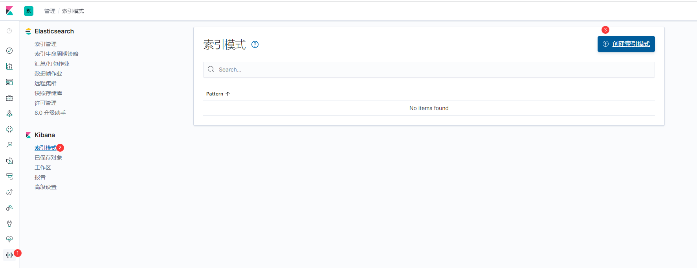  

步骤2: 搜索索引名就可以，如:nezha_user 的索引数据，则不需要通配符，直接使用nezha_user这个名字作为索引模式即可，如下图
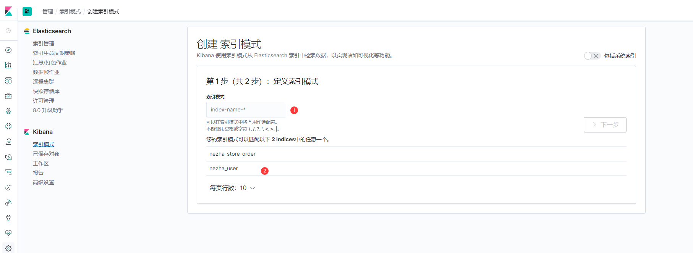

这里直接用 nezha_user* 作为索引模式（使用了通配符星号，代表匹配任意字符）
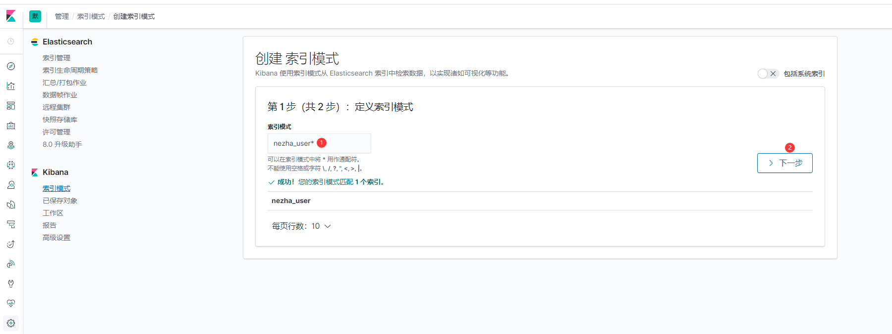

**Discover 功能介绍**  
进入Discover页面，默认展示的索引数据不一定是我们想看的数据，可以点击 change 切换到 nezha_user* 索引模式
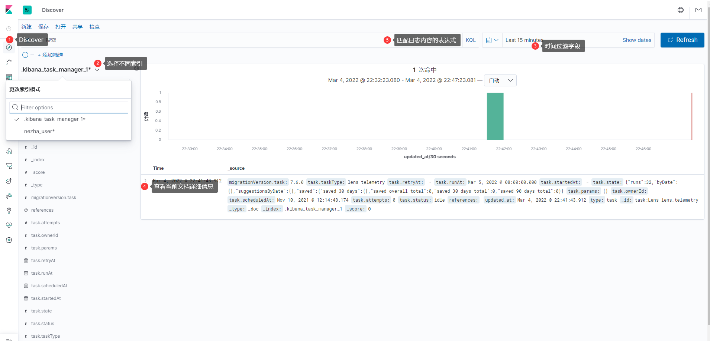 

**查询数据**
通过 KQL 查询语法查询ES数据，可以把你感兴趣的字段名称和值当做搜索的条件，对于数字字段您可以使用比较运算符，例如大于（>）、小于（<）或等于（=）。您可以使用逻辑运算符 AND，OR 和 NOT 连接搜索条件

例如：  
id大于2且小于10的用户信息

```shell
id > 2 and id < 10
```
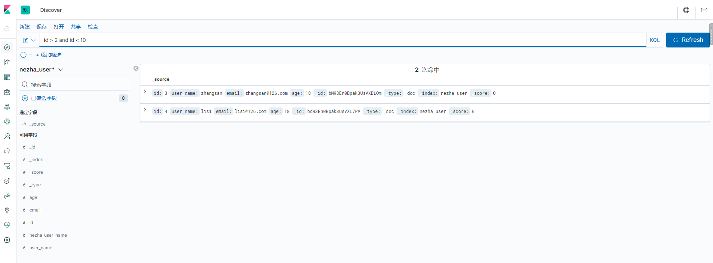
查询用户编号等于 1 的信息
```shell
id : 1
```


**过滤字段**
默认查询结果展示索引的所有字段，信息比较多，我们可以选择展示指定的文档字段
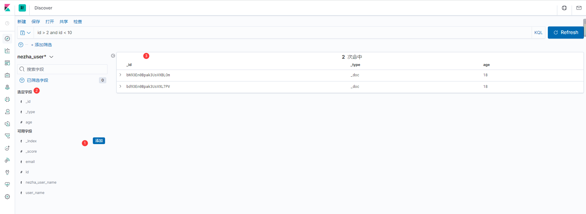 

### 5.3 查询语法
Kibana Query Language （KQL）查询语法是Kibana为了简化ES查询设计的一套简单查询语法，Kibana支持索引字段和语法补全。  

> 等值匹配(equals)

语法：字段名: 匹配值

例子：

>name: nezha

查询name字段匹配"nezha"字符串的文档。 等值匹配也支持通配符（*），通过通配符实现模糊搜索
>name: ne*zha

> 存在检查(exists)  

语法： 字段名:*  

例：
> FlightNum:*    

匹配包含FlightNum字段的文档  

> 关系运算符    

关系运算符只能用在数值和时间类型的字段
支持关系运算符如下：  

- <= 小于等于  
- `>=` 大于等于  
- < 小于
- `>`大于
例：  
> stock >= 300

>逻辑运算符  

支持逻辑运算符如下:
- and
- or

> num > 300 and num < 600 

num 大于300且 num 小于600

### 5.4 开发工具
Kibana开发工具（Dev Tools）主要提供了下面三种功能

- 调试Elasticsearch查询表达式
- 分析Elasticsearch查询表达式性能
- 调试grok

> Console  
通过Console（控制台）调试Elasticsearch查询表达式  

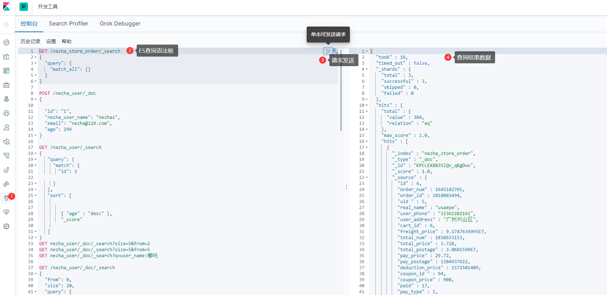


> Search Profiler
分析Elasticsearch查询表达式性能
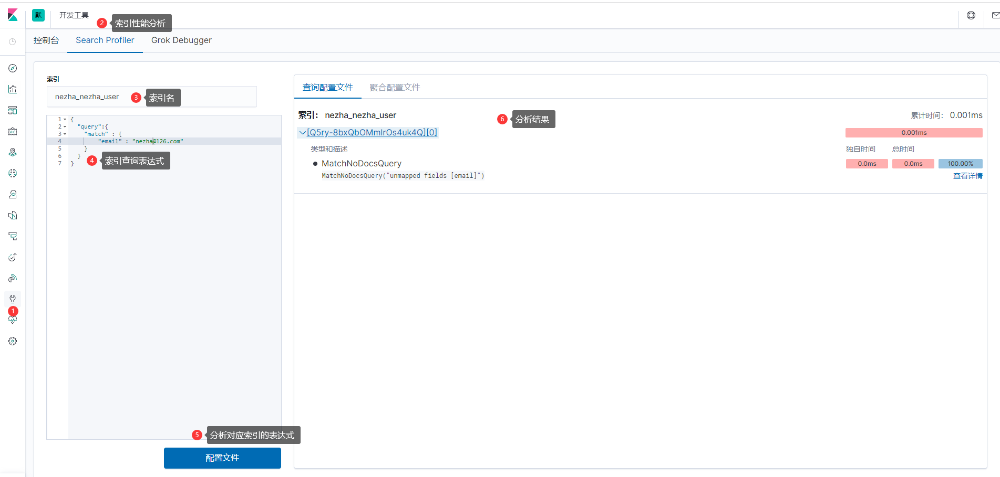

> Grok Debugger  
主要用于支持在线调试Logstash grok表达式。  

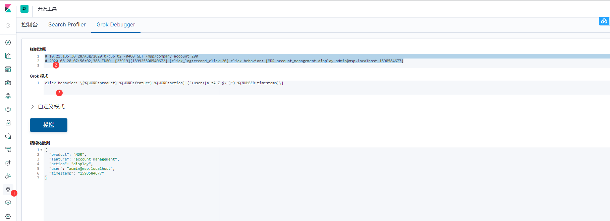
Logstash定义120多种默认的匹配模式，可以在github上找到详细的信息：
>https://github.com/logstash-plugins/logstash-patterns-core/tree/master/patterns

Grok也支持基于正则的自定义模式：
```sh
(?<字段的名字>正则表达式)
```


