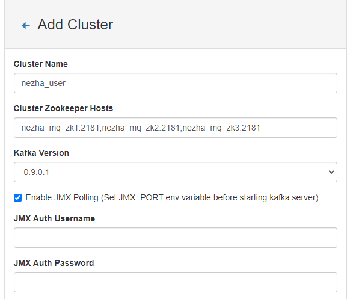

# 0 准备安装环境
```shell
sudo  docker  network create --driver bridge --subnet 10.12.0.0/24 nezha_mq_net
sudo  docker  network ls | grep nezha_mq_net
sudo  docker  network inspect nezha_mq_net
sudo  docker  network rm nezha_mq_net

#删除指定名字的容器
sudo docker rm -f $(sudo docker ps -a |  grep "nezha_mq*"  | awk '{print $1}')
#删除全部容器
docker rm $(docker ps -aq)
```

## 1 安装
```shell
sudo docker-compose -f docker-compose-zookeeper-cluster.yml up -d

sudo docker-compose -f docker-compose-kafka-cluster.yml up -d
```
## 2 zookeeper测试
### 2.1 进入容器 
- 查看 nezha_mq_zk1 角色
```shell
# 查看当前容器的zk下的集群的状态
[nezha@mq kafka]$ sudo docker exec -it nezha_mq_zk1 /bin/sh 
root@nezha_mq_zk1:/apache-zookeeper-3.7.0-bin # zkServer.sh status

ZooKeeper JMX enabled by default
Using config: /conf/zoo.cfg
Client port found: 2181. Client address: localhost. Client SSL: false.
Mode: follower
root@nezha_mq_zk1:/apache-zookeeper-3.7.0-bin# exit
```
- 查看 nezha_mq_zk2 角色
```shell
[nezha@mq kafka]$ sudo docker exec -it nezha_mq_zk2 /bin/sh
root@nezha_mq_zk2:/apache-zookeeper-3.7.0-bin# zkServer.sh status

ZooKeeper JMX enabled by default
Using config: /conf/zoo.cfg
Client port found: 2181. Client address: localhost. Client SSL: false.
Mode: follower
root@nezha_mq_zk2:/apache-zookeeper-3.7.0-bin# exit
```
- 查看 nezha_mq_zk3 角色
```shell
[nezha@mq kafka]$ sudo docker exec -it nezha_mq_zk3 bash
root@nezha_mq_zk3:/apache-zookeeper-3.7.0-bin#  zkServer.sh status

ZooKeeper JMX enabled by default
Using config: /conf/zoo.cfg
Client port found: 2181. Client address: localhost. Client SSL: false.
Mode: follower
root@nezha_mq_zk3:/apache-zookeeper-3.7.0-bin# exit
```

## 3 Kafka 测试
- 可视化管理

kafka-manager 模块。它是 kafka 的可视化管理模块。因为 kafka 的元数据、配置信息由 Zookeeper 管理，这里我们在 UI 页面做下相关配置。

1. 浏览器访问，然后添加相关配置

```shell
192.168.30.130:9100  
```



*3.* 配置后我们可以看到默认有一个 topic(__consumer_offsets)，3 个 brokers。该 topic 分 50 个 partition，用于记录 kafka 的消费偏移量，需要消费消费后才会出现


## 4. 命令行生产与消费

### 4.1 创建主题

```bash
# 进入容器
[nezha@mq ~]# sudo docker exec -it nezha_mq_kafka1 bash   
# 进入安装目录
bash-5.1# cd /opt/kafka/   
# 查看主题列表
bash-5.1# ./bin/kafka-topics.sh --list --zookeeper nezha_mq_zk1:2181,nezha_mq_zk2:2181,nezha_mq_zk3:2181   
__consumer_offsets
# 新建主题
bash-5.1# ./bin/kafka-topics.sh --create --zookeeper nezha_mq_zk1:2181,nezha_mq_zk2:2181,nezha_mq_zk3:2181 --replication-factor 2 --partitions 3 --topic user    
Created topic user.
```

> 说明:
> --replication-factor 副本数;
> --partitions 分区数;
> replication<=broker(一定);
> 有效消费者数<=partitions 分区数(一定);

新建主题后, 再次查看映射目录, 由图可见，partition 在 3 个 broker 上均匀分布。


### 4.2 生产消息

```bash
bash-5.1# ./bin/kafka-console-producer.sh --broker-list nezha_mq_kafka1:9092,nezha_mq_kafka2:9092,nezha_mq_kafka3:9092  --topic user
>nezha1
>nezha2
>nezha3
>nezha4
>nezha5
>nezha6
```

### 4.3 消费消息

```bash
bash-5.1# ./bin/kafka-console-consumer.sh --bootstrap-server nezha_mq_kafka1:9092,nezha_mq_kafka2:9092,nezha_mq_kafka3:9092 --topic user --from-beginning
msg1
msg3
msg2
msg4
msg6
msg5
```

> --from-beginning 代表从头开始消费

### 5.4 消费详情

*查看消费者组*

```bash
bash-5.1# ./bin/kafka-consumer-groups.sh --bootstrap-server nezha_mq_kafka1:9092,nezha_mq_kafka2:9092,nezha_mq_kafka3:9092 --list
KafkaManagerOffsetCache
console-consumer-86137
```

*消费组偏移量*

```bash
bash-5.1# ./bin/kafka-consumer-groups.sh --bootstrap-server nezha_mq_kafka1:9092,nezha_mq_kafka2:9092,nezha_mq_kafka3:9092 --describe --group KafkaManagerOffsetCache
```

*查看 topic 详情*

```bash
bash-5.1# ./bin/kafka-topics.sh --zookeeper nezha_mq_zk1:2181,nezha_mq_zk2:2181,nezha_mq_zk3:2181 --describe --topic user
Topic: test PartitionCount: 3   ReplicationFactor: 2    Configs:
    Topic: test Partition: 0    Leader: 3   Replicas: 3,1   Isr: 3,1
    Topic: test Partition: 1    Leader: 1   Replicas: 1,2   Isr: 1,2
    Topic: test Partition: 2    Leader: 2   Replicas: 2,3   Isr: 2,3
```


*查看.index 索引文件*

```bash
bash-5.1# ./bin/kafka-run-class.sh kafka.tools.DumpLogSegments --files /kafka/kafka-logs-8d3c599d57ac/user-0/00000000000000000000.index

Dumping /kafka/kafka-logs-8d3c599d57ac/user-0/00000000000000000000.index
offset: 0 position: 0

```

*查看.timeindex 索引文件*

```bash
bash-5.1# ./bin/kafka-run-class.sh kafka.tools.DumpLogSegments --files /kafka/kafka-logs-8d3c599d57ac/user-0/00000000000000000000.timeindex  --verify-index-only

Dumping /kafka/kafka-logs-8d3c599d57ac/user-0/00000000000000000000.timeindex
Found timestamp mismatch in :/kafka/kafka-logs-8d3c599d57ac/user-0/00000000000000000000.timeindex
  Index timestamp: 0, log timestamp: 1632351087947

```

